# Pràctica d'Avaluació Contínua 4: Programació per a la ciència de dades

Francesc Ferré Tarrés

Màster Universitari en Ciències de Dades

# Implementació de la pràctica emprant control de versions i repositori GIT

Per tal de realitzar aquesta pràctica i evitar problemes i poder fer *rollbacks* en el codi, he usat el control de
versions que GIT proporciona tot creant un repositori en el meu GitHub personal. 
La url del projecte és https://github.com/cescFT/PCD_PAC4

Tal com es pot observar, he intentat crear branques específiques per a realitzar les diferents parts del codi, tenint
una visió incremental d'aquest, com si fos una ceba tot tenint múltiples capes fins arribar a construir tot el programa.

# Estructures de les carpetes i fitxers

* **data/**: Conté els fitxers de la PAC4 a ser processats.
* **doc/**: Conté la documentació creada a través dels *docstrings* del codi.
* **screenshots/**: Conté les captures de pantalla com a evidències de cada apartat.
  * **screenshots/Creant_executable_pel_setup_py**: Captures de pantalla referents a l'execució de l'executable 
  creat a través del setup.py.
  * **screenshots/ex1**: Captures de pantalla referents a l'exercici 1 + test i coverage.
  * **screenshots/ex2**: Conté subcarpetes mostrant com carrega les dades necessaries per a funcionar en funció del
  fitxer carregat en l'exercici 1 i el coverage + test.
  * **screenshots/ex3**: Captures de pantalla referents a l'exercici 3 + test i coverage. 
  * **screenshots/ex4**: Captures de pantalla referents a l'exercici 4 + test i coverage.
  * **screenshots/main**: Conté captures de pantalla que tenen a veure amb l'execució del main i el seu correcte
  funcionament esperat.
  * **screenshots/PEP8**: Conté captures de pantalla com a evidència que es compleix el PEP8, tant en el testing
  com en el src.
  * **screenshots/virtualenv**: Conté evidència a través d'una captura de pantalla mostrant com creo l'entorn virutal
  per a poder implementar el codi de la PAC4.
* **src/**: Conté els paquets creats per a solucionar la pràctica.
    * **src/execution/**: Conté el `main.py` el qual permet passar-li arguments, tal com s'anomena en l'enunciat.
    * **src/img/**: Conté la imatge del gràfic creat com a resposta en l'exercici 3. Si no està creada la carpeta,
    el codi la crearà.
    * **src/modules/exercises**: Conté subpaquets, un per cada exercici, a més dels mòduls auxiliars creats per a donar
    resposta a l'exercici corresponent.
      * **src/modules/exercises/exercise_1**: Conté el mòdul executable de l'exercici 1 i mòduls auxiliars.
      * **src/modules/exercises/exercise_2**: Conté el mòdul executable de l'exercici 2 i mòduls auxiliars.
      * **src/modules/exercises/exercise_3**: Conté el mòdul executable de l'exercici 3 i mòduls auxiliars.
      * **src/modules/exercises/exercise_4**: Conté el mòdul executable de l'exercici 4 i mòduls auxiliars.
    * **src/report/**: Conté el JSON creat com a resposta de l'exercici 4. Si no existeix, el codi la crearà, jutament
    amb el JSON.
  * **tests/**: Conté subpaquets, un per cada exercici amb cada suite i classes de test, juntament també amb un paquet
  específic pel main.
    * **tests/execution**: Conté test del main + suite per executar-lo.
    * **tests/exercise_1**: Conté test de l'exercici 1 + suite per executar-lo.
    * **tests/exercise_2**: Conté test de l'exercici 2 + suite per executar-lo.
    * **tests/exercise_3**: Conté test de l'exercici 3 + suite per executar-lo.
    * **tests/exercise_4**: Conté test de l'exercici 4 + suite per executar-lo.

Finalment, en el root del projecte hi trobem els fitxers que es demanen en la PAC:
* **.pylintrc**: Permet configurar el paquet *pylint*, el qual retorna si es compleix el PEP8.
* **LICENSE**: Fitxer de llicència GPL-3.0 license.
* **README.md**: Aquest mateix fitxer, el qual dóna detalls sobre l'estructura i com executar el projecte.
* **requirements.txt**: Dependències necessàries perquè funcioni el projecte en un entorn virtual nou.
* **setup.py**: Fitxer que permet la instal·lació del projecte com a programa per la CLI.

# Desenvolupament del projecte en entorn virtual

Aquest projecte ha estat desenvolupat a través d'un entorn virtual. Per a crear un entorn virutal, cal primer instal·lar
el paquet `virtualenv`.

```shell
pip install virtualenv
```

Un cop està instal·lat aquest paquet, situeu-vos dins de la carpeta del projecte:

```shell
cd PCD_PAC4
```

*Nota: D'ara en endavant, s'assumeix que l'usuari està en aquesta carpeta.*

El que hem de fer és crear un entorn virtual, a través de la comanda:

```shell
virtualenv <nom_entorn_virtual>
```

*Nota: Substituïu `<nom_entorn_virtual>` pel nom que li volgueu donar, normalment es diu `venv`.*
*En cas que no funcioni, de forma alternativa es pot executar la comanda `python -m venv <nom_entorn_virtual>`*

Llavors, en un entorn Windows, per accedir a l'entorn, cal executar l'script següent:

```shell
.\<nom_entorn_virtual>\Scripts\activate.ps1
```

D'acord amb la documentació de la teoria, en principi en un Linux, la comanda seria:

```shell
source <nom_entorn_virtual>/bin/activate
```
*Nota: Substituïu <nom_entorn_virtual> pel nom que li heu donat a l'entorn virtual*

A continuació, instal·lem els paquets necessaris per a poder executar el projecte a través de la següent comanda:

```shell
pip install -r requirements.txt
```

Si volem executar el projecte, cal executar la següent comanda (provada en entorn Windows):

```shell
python3 -m src.execution.main
```

Hi permet el pas d'arguments, els quals són:

* **-h**: Mostra ajuda.
* **-ex <num_ex>**: El que fa és executar tots els exercici de l'1 al `<num_ex>`, atès que són exercicis progressius.
    * *Nota: Si no se li passa aquest paràmetre, per defecte, executarà tots 4 exercicis*
    * *Nota: Si se li passa un valor no vàlid, retorna un error indicant que necessita un exercici vàlid*

Finalment, si desitgem desactivar l'entorn, utilitzarem la comanda:

```shell
deactivate
```

## Execució dels tests

Per tal d'executar els tests, necessitem accedir en l'entorn virtual `<nom_entorn_virtual>`, i la comanda per
executar els tests serà:

```shell
python3 -m tests.exercise_<x>.suite_ex<x>
```

*Nota: Substituïu `<x>` per un número d'exercici vàlid (1-4)*

Per al cas del test del main:

```shell
python3 -m tests.execution.suite_main
```

## Càlcul del *Coverage* del codi

Per tal de calcular el *coverage* del codi, necessitem estar en l'entorn virtual `<nom_entorn_virtual>` el qual ja té
integrat, a través de la instal·lació del `requirements.txt` un parquet anomenat *coverage*, el qual va ser instal·lat
a través de la comanda:

```shell
pip install coverage
```

Per tal de calcular el coverage, la comanda que s'ha d'executar és:

```shell
coverage run -m tests.exercise_<x>.suite_ex<x>
coverage report
```

*Nota: Subtituïu `<x>` pel número d'exercici vàlid que volgueu saber el coverage*

Per al cas del main:

```shell
coverage run -m tests.execution.suite_main
coverage report
```

## Generar documentació en HTML a partir del *docstring*

Per tal de generar la documentació a través del *docstring*, he instal·lat en l'entorn virtual el paquet *pydoctor* a 
través de la comanda:

```shell
pip install pydoctor
```

Llavors per a generar la documentació, l'he fet amb aquesta comanda:

```shell
pydoctor --make-html --project-name "PCD_PAC4 - Francesc Ferré Tarrés" --html-output doc src tests
```

Llavors, de forma automàtica agafa tots els *docstrings* i els traspassa en varis HTML. Si es vol visualitzar, accedim a
`doc/` i veiem que hi ha un `index.html`. Si l'obrim en un navegador, observarem tota la documentació en format HTML,
tal com es demana en l'enunciat de la PAC4.

## Revisar que es compleix PEP8

Per tal de veure si es compleix el PEP8, he instal·lat el paquet *pylint*, a través de la comanda:

```shell
pip install pylint
```

*Nota: en el `requirements.txt` ja hi ha la dependència i cal estar en l'entorn virtual `<nom_entorn_virtual>` per a 
executar la revisió del PEP8.*

Per tal de comprovar si es compleix, executem la comanda:

```shell
pylint src/
```

I el fitxer `.pylintrc` ha estat generat a través de la comanda (powershell de Windows):

```shell
pylint --generate-rcfile | Out-File -Encoding utf8 .pylintrc
```

Per tal de comprovar el PEP8 en els tests, cal executar la següent comanda:

```shell
pylint tests/
```

# Execució projecte com a programa de CLI - Producció

Per tal d'assolir l'expertesa i un desplegament de l'aplicació creada, he generat el fitxer `setup.py`, el qual
instal·la dependències, detecta els paquets personalitzats de la pràctica i acaba generant un executable, anomenat
`PCD_PAC4-cli`.

Així doncs, per aconseguir aquest executable, executarem a l'arrel del projecte la comanda

```shell
pip install .
```

Quan aquest hagi acabat, en principi generarà l'executable `PCD_PAC4-cli`, el qual es pot executar per terminal,
en l'arrel del projecte, i que admet els arguments `-h` i `-ex <num_ex>` anteriorment descrits.

Així doncs, la comanda preparada per ser executada en l'arrel del projecte és la següent:

```shell
PCD_PAC4-cli
```

# Galeria d'imatges com a joc de proves

## Captures de pantalla referents a PEP8

### PEP8 Codi src


### PEP8 Codi tests


## Entorn virutal


## Main

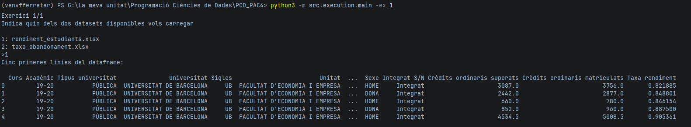

*Prova: En el main passa-li la opció -ex amb un exercici vàlid*


*Prova: En el main passant-li la opció -ex amb un exercici no vàlid*


*Prova: En el main passant-li la opció -h*


*Prova: En el main passant-li un fitxer amb el paràmetre -file*

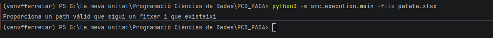

*Prova: En el main passant-li un fitxer amb el paràmetre -file no vàlid*


*Prova: En el main passant-li un fitxer amb el paràmetre -file vàlid i exercici vàlid*


*Execució dels tests*

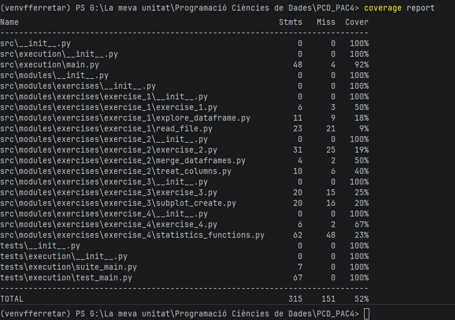

*Coverage main*

## Exercici 1

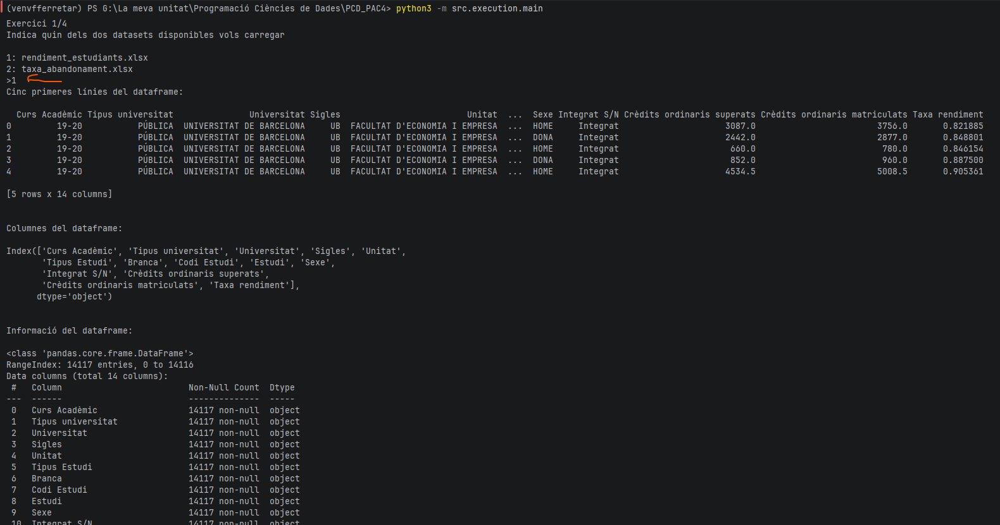

*Prova: Demanem fitxer per a llegir*

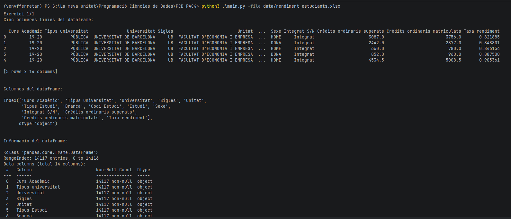
*Prova: Passem el fitxer per a llegir com a paràmetre*

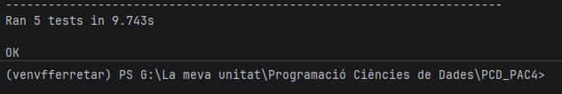
*Execució dels tests de l'exercici 1*

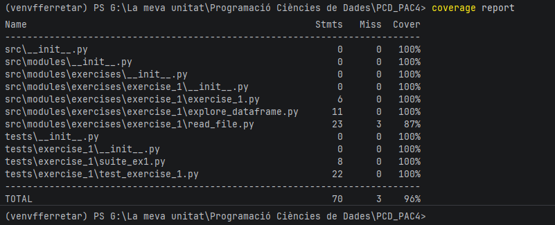
*Mostra del coverage de l'exercici 1*

## Exercici 2

### Carregant en primer lloc el fitxer rendiment_estudiants


*En el primer exercici carreguem el fitxer de rendiment estudiants*

.png)
*Primera part de la execució de l'exercici 2*

.png)
*Segona part de la execució de l'exercici 2*

### Carregant en primer lloc el fitxer taxa_abandonament

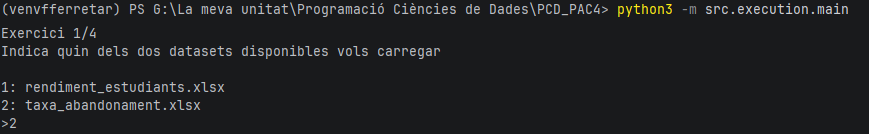
*En el primer exercici carreguem el fitxer de taxa abandonament*

.png)
*Primera part de la execució de l'exercici 2*

.png)
*Segona part de la execució de l'exercici 2*

### Test i coverage

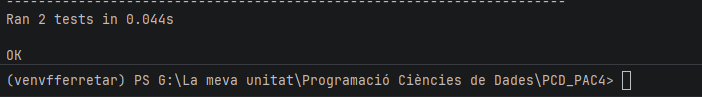
*Mostra del test de l'exercici 2*


*Mostra del coverage de l'exercici 2*

## Exercici 3

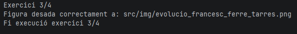

*Execució de l'exercici 3*


*Figura desada a la carpeta on indica l'enunciat*

## Exercici 4

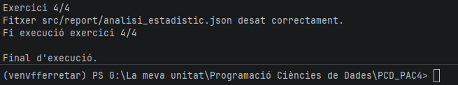

*Execució de l'exercici 4*


*Fitxer generat correctament*

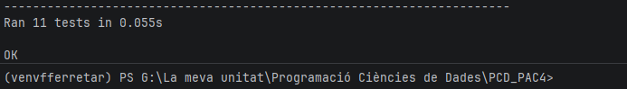

*Test exercici 4*

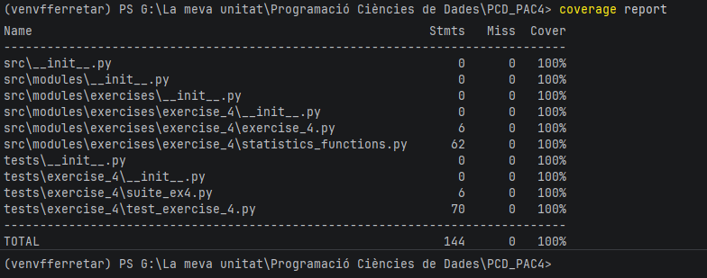

*Coverage exercici 4*

## Creació de la comanda CLI a través del setup.py


*Mostra del pip install .*


*Un cop instal·lat, mostra com la comanda d'ajuda funciona correctament*

.png)

*Exemple d'execució a través de la comanda amb el paràmetre -ex*

## Generació de la documentació

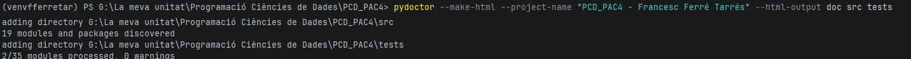

# Referències web per a realitzar la pràctica

Per tal de complir amb el PEP8, no puc posar línies de més de 100 caràcters, i en molts casos les URLs que he consultat
tenen més de 100 caràcters, i això em fa baixar la puntuació del PEP8. És per això que he decidit posar les referències
en un apartat del README.

* Teoria
* Enunciat pràctica
* https://docs.python.org/3/library/argparse.html
* https://stackoverflow.com/questions/64420348/ignore-userwarning-from-openpyxl-using-pandas
* https://stackoverflow.com/questions/9426045/difference-between-exit0-and-exit1-in-python
* https://stackoverflow.com/questions/52129876/userwarning-pandas-doesnt-allow-columns-to-be-created-via-a-new-attribute-name
* https://pandas.pydata.org/docs/reference/api/pandas.DataFrame.merge.html
* https://www.w3schools.com/python/ref_func_zip.asp
* https://matplotlib.org/stable/gallery/subplots_axes_and_figures/subplots_demo.html
* https://matplotlib.org/stable/api/_as_gen/matplotlib.pyplot.savefig.html
* https://matplotlib.org/stable/api/_as_gen/matplotlib.axes.Axes.plot.html
* https://matplotlib.org/stable/api/_as_gen/matplotlib.axes.Axes.grid.html
* https://docs.python.org/es/dev/library/unittest.mock.html
* https://docs.python.org/3/library/unittest.mock.html
* https://docs.python.org/3/library/unittest.mock.html#unittest.mock.MagicMock
* https://docs.python.org/3/library/unittest.mock.html#unittest.mock.Mock.assert_called_with
* https://docs.python.org/3/library/unittest.mock.html#unittest.mock.Mock.assert_not_called
* https://docs.python.org/3/library/unittest.mock.html#unittest.mock.Mock.return_value
* https://docs.python.org/3/library/unittest.mock.html#unittest.mock.Mock.side_effect
* https://pandas.pydata.org/docs/reference/api/pandas.testing.assert_frame_equal.html
* https://matplotlib.org/stable/api/_as_gen/matplotlib.pyplot.close.html
* https://www.geeksforgeeks.org/python/python-unittest-assertin-function/
* https://docs.python.org/3/library/unittest.mock.html#mock-open
* https://stackoverflow.com/questions/15763394/mocking-two-functions-with-patch-for-a-unit-test
* https://www.youtube.com/watch?v=GaWs-LenLYE